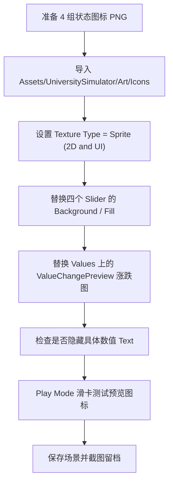

# 四项状态图标 / Slider 替换专项指南

本文只讲一件事：如果你现在要把顶部四项状态改成大学生模拟器自己的视觉，例如“身心、学业、人际、经济”的图标、状态条、滑卡前预览图标，应该怎么做，以及 Unity 背后的工作原理。

当前工程事实：

- 当前主场景：`Assets/Kings/Game.unity`
- UI 技术：UGUI，也就是 `Canvas + RectTransform + Image + Text + Slider`
- 顶部状态栏路径：`GameCanvas/GamePanel/TopPanel/MainStatsPanel`
- 当前四项状态的 UI 仍沿用 Kings 旧命名：`ArmySlider / PeopleSlider / ReligionSlider / MoneySlider`
- 当前四项状态的真实游戏含义已经改为：`bodyMind / academics / relationships / economy`

## 1. 先看状态栏在哪里


屏幕上这一排图标不是普通静态图片，而是四个 `Slider`。它们看起来像图标，是因为 `Slider` 的 `Background` 和 `Fill` 子节点使用了图标 Sprite。

| 屏幕含义 | 值对象 | 当前 UI 名 | UI 路径 |
| --- | --- | --- | --- |
| 身心 | `Values/BodyMind` | `ArmySlider` | `GameCanvas/GamePanel/TopPanel/MainStatsPanel/ArmySlider` |
| 学业 | `Values/Academics` | `PeopleSlider` | `GameCanvas/GamePanel/TopPanel/MainStatsPanel/PeopleSlider` |
| 人际 | `Values/Relationships` | `ReligionSlider` | `GameCanvas/GamePanel/TopPanel/MainStatsPanel/ReligionSlider` |
| 经济 | `Values/Economy` | `MoneySlider` | `GameCanvas/GamePanel/TopPanel/MainStatsPanel/MoneySlider` |

还有一个 `MarriageSlider`，但它当前是 inactive，不属于 V1 的四项主状态。

## 2. 单个 Slider 的构成


以 `ArmySlider` 为例，层级结构是：

```text
GameCanvas/GamePanel/TopPanel/MainStatsPanel/
  ArmySlider
    Background
    Fill
    StatChangePrevImage
    StatChangePrevText
```

每个子节点的作用：

| 子节点 | 组件 | 作用 | 替换时看哪里 |
| --- | --- | --- | --- |
| `ArmySlider` | `Slider` | 接收 0..1 的 UI 值，决定 Fill 显示多少 | `Slider > Value`、`Fill Rect` |
| `Background` | `Image` | 状态图标底图，通常是灰色/暗色底 | `Image > Source Image` |
| `Fill` | `Image` | 状态图标填充层，随 Slider 值变化显示 | `Image > Source Image`、`Color` |
| `StatChangePrevImage` | `Image` | 滑卡前预览会涨/会跌/未知 | `Image > Source Image`，运行时会被脚本替换 |
| `StatChangePrevText` | `Text` | 滑卡前预览的文字数字 | 如不想显示精确数字，应禁用或清空绑定 |

注意：你看到的“状态图标”通常需要同时换 `Background` 和 `Fill`。只换其中一个，另一个可能还会露出 Kings 旧图。

## 3. 替换前准备素材

推荐先准备这些图片：

```text
Assets/UniversitySimulator/Art/Icons/
  icon_body_mind_bg.png
  icon_body_mind_fill.png
  icon_academics_bg.png
  icon_academics_fill.png
  icon_relationships_bg.png
  icon_relationships_fill.png
  icon_economy_bg.png
  icon_economy_fill.png
  status_up.png
  status_down.png
  status_unknown.png
  status_none.png
```

建议规格：

| 用途 | 建议 |
| --- | --- |
| 四项状态图标 | 透明 PNG，正方形，至少 `124 x 124` |
| 背景层 `_bg` | 低亮度、灰色、半透明或空心版本 |
| 填充层 `_fill` | 亮色、实心版本 |
| 预览图标 | 透明 PNG，表达“上升 / 下降 / 不确定 / 无变化” |

导入 Unity 后，选中图片，在 Inspector 设置：

- `Texture Type`：`Sprite (2D and UI)`
- `Sprite Mode`：`Single`
- 有透明图时保留 Alpha
- 如果图标模糊，把 `Max Size` 调到 `256` 或更高

## 4. 只替换四个主图标：最常用步骤

下面以“身心”这一个状态为例，其他三项重复同样步骤。

1. 打开 Unity 场景 `Assets/Kings/Game.unity`。
2. 在 Hierarchy 找到：

```text
GameCanvas
  GamePanel
    TopPanel
      MainStatsPanel
        ArmySlider
```

3. 展开 `ArmySlider`。
4. 选中 `Background`。
5. 在 Inspector 找到 `Image` 组件，把 `Source Image` 改成 `icon_body_mind_bg`。
6. 选中 `Fill`。
7. 在 Inspector 找到 `Image` 组件，把 `Source Image` 改成 `icon_body_mind_fill`。
8. 检查 `Fill` 的 `Color`，如果颜色不是白色，Sprite 可能会被染色。要保留原图颜色，就把 Color 设为白色。
9. 保存场景。

四项对应关系：

| 状态 | UI 对象 | Background Sprite | Fill Sprite |
| --- | --- | --- | --- |
| 身心 | `ArmySlider` | `icon_body_mind_bg` | `icon_body_mind_fill` |
| 学业 | `PeopleSlider` | `icon_academics_bg` | `icon_academics_fill` |
| 人际 | `ReligionSlider` | `icon_relationships_bg` | `icon_relationships_fill` |
| 经济 | `MoneySlider` | `icon_economy_bg` | `icon_economy_fill` |

不建议第一步就重命名 `ArmySlider` 等对象。Unity 的序列化引用一般按对象引用保存，不是按名字保存，但这个资源包里也可能有动画或脚本按名字找对象。先完成视觉替换，确认稳定后再考虑统一命名。

## 5. 替换滑卡前的涨跌预览图标

滑卡时，如果某个选择会影响状态，状态图标旁边会出现“涨、跌、未知”等预览。这部分不是直接由四个 Slider 的 `Source Image` 控制，而是由 `ValueChangePreview` 统一管理。

入口在：

```text
Values
  ValueChangePreview
```

在 `Values` 这个对象上找 `ValueChangePreview` 组件，重点字段：

| 字段 | 作用 |
| --- | --- |
| `selectedSpriteset` | 当前使用哪一组预览图 |
| `spriteSets[].valueRises` | 状态会上升时显示的图 |
| `spriteSets[].valueFalls` | 状态会下降时显示的图 |
| `spriteSets[].valueUnclear` | 结果随机或不确定时显示的图 |
| `spriteSets[].showTextValue` | 是否显示具体数值 |
| `spriteSets[].textFormatter` | 显示数字时的格式 |
| `noChanges` | 没有变化时显示的透明或空图 |

本项目设计要求“不显示精确数字”。所以建议：

- 把 `showTextValue` 设为 `false`，或者
- 清空四个 `ValueScript.UserInterface.valueChangePreview.valueChangeText` 的引用。

四个预览 Image 的位置：

```text
ArmySlider/StatChangePrevImage
PeopleSlider/StatChangePrevImage
ReligionSlider/StatChangePrevImage
MoneySlider/StatChangePrevImage
```

四个预览 Text 的位置：

```text
ArmySlider/StatChangePrevText
PeopleSlider/StatChangePrevText
ReligionSlider/StatChangePrevText
MoneySlider/StatChangePrevText
```

如果你换了 `status_up.png / status_down.png / status_unknown.png`，但游戏里还显示旧图，优先检查 `Values` 上的 `ValueChangePreview`，不是检查单个 Slider。

## 6. 替换数值区间图标

`ValueScript` 支持“数值到某个区间后换图”。比如身心很低时显示疲惫图标，中间显示普通图标，很高时显示封闭/紧绷图标。

入口分别是：

```text
Values/BodyMind
Values/Academics
Values/Relationships
Values/Economy
```

在每个对象上找 `ValueScript > UserInterface > valueDependingIcons`。

重点字段：

| 字段 | 作用 |
| --- | --- |
| `baseIcons` | 运行时要被替换的目标 Image 数组 |
| `valueIcon` | 每个区间对应一个 `minValue + Sprite` |

工作方式：

- `baseIcons` 里放你想被替换的 Image，例如对应 Slider 的 `Background` 或 `Fill`。
- `valueIcon` 里按从小到大的 `minValue` 配 Sprite。
- 游戏运行时，当前值大于等于某个 `minValue`，就会把对应 Sprite 写到 `baseIcons` 的 `overrideSprite`。

例子：

| minValue | 身心图标含义 |
| --- | --- |
| `0` | 透支 / 疲惫 |
| `30` | 普通 |
| `70` | 紧绷 / 自我封闭 |

如果你只是想把四个主图标换成固定图标，不需要配置 `valueDependingIcons`；只替换 `Background` 和 `Fill` 即可。

## 7. Unity 原理图


核心逻辑在 `Assets/Kings/scripts/ValueScript.cs`：

```csharp
if (UserInterface.uiSlider != null) {
    UserInterface.uiSlider.value = uiValue / limits.max;
}
```

这意味着：

- 游戏内部值通常是 `0..100`。
- `Slider.value` 需要的是 `0..1`。
- 所以 `50 / 100 = 0.5`，Slider 显示一半。
- `Fill` 子节点负责把这个比例画出来。

预览图标的核心逻辑也在 `ValueScript.cs`：

```csharp
UserInterface.valueChangePreview.valueChangeImage.overrideSprite =
    ValueChangePreview.instance.getPreviewSprite(...);
```

这意味着：

- `StatChangePrevImage` 平时可能是空图。
- 当你拖动卡牌、某个选择会影响状态时，脚本会把它替换成涨/跌/未知图标。
- 这个图标来自 `Values` 上的 `ValueChangePreview` 配置。

数值区间换图的核心逻辑是：

```csharp
if (value >= valueIcon[i].minValue) {
    changedSprite = valueIcon[i].icon;
}
...
im.overrideSprite = changedSprite;
```

这意味着：

- 不是每帧都手动判断 UI 图要显示什么，而是由 `ValueScript` 根据当前值自动选图。
- `baseIcons` 是目标 Image。
- `valueIcon` 是“阈值 -> 图”的配置表。

## 8. Unity 里 Image、Sprite、Slider 是怎么配合的

简单理解：

| Unity 概念 | 在这里的作用 |
| --- | --- |
| `GameObject` | Hierarchy 里的节点，例如 `ArmySlider`、`Fill` |
| `Component` | 挂在节点上的功能，例如 `Image`、`Slider`、`ValueScript` |
| `Sprite` | Unity 可用于 UI 的图片资源 |
| `Image.Source Image` | 这个 UI 节点显示哪张 Sprite |
| `Slider` | 一个 0..1 的 UI 控件 |
| `Fill Rect` | Slider 用哪个子节点显示填充部分 |
| `ValueScript` | Kings 的游戏数值脚本，把内部状态同步到 UI |
| `overrideSprite` | 脚本运行时临时覆盖 Image 显示的 Sprite |

所以，替换状态图标并不是“换一张屏幕贴图”，而是替换多个 UI Image 引用，并保持 `ValueScript -> Slider -> Image` 的连接不被破坏。

## 9. 推荐替换顺序



## 10. 检查清单

替换完后逐项检查：

- `GameCanvas/GamePanel/TopPanel/MainStatsPanel` 下四个主 Slider 都还 active。
- 四个 Slider 的 `Background` 和 `Fill` 都换成了大学生主题图。
- `Values/BodyMind` 的 `ValueScript.valueType` 仍是 `Body Mind`。
- `Values/Academics` 的 `ValueScript.valueType` 仍是 `Academics`。
- `Values/Relationships` 的 `ValueScript.valueType` 仍是 `Relationships`。
- `Values/Economy` 的 `ValueScript.valueType` 仍是 `Economy`。
- 四个 `ValueScript.UserInterface.uiSlider` 仍分别指向对应 Slider。
- `ValueChangePreview` 的涨/跌/未知图已经替换。
- `showTextValue` 已关闭，或者四个 `StatChangePrevText` 不显示具体数字。
- Play Mode 下滑动卡牌时，预览图标出现的位置正确。
- 不删除、不重排 `Assets/Kings/scripts/valueDefinitions.cs` 里的四项枚举。

## 11. 常见问题

| 问题 | 常见原因 | 处理 |
| --- | --- | --- |
| 图标导入后拖不到 Image 里 | 图片不是 Sprite | 选中图片，把 `Texture Type` 改成 `Sprite (2D and UI)` |
| 只换了一个状态图，运行时又变回旧图 | `valueDependingIcons` 在运行时覆盖了 Image | 检查对应 `Values/<State>/ValueScript.UserInterface.valueDependingIcons` |
| 预览图标还是旧的 | 改错位置 | 改 `Values` 上的 `ValueChangePreview` |
| 还显示 `+5`、`-8` 这类数字 | `showTextValue` 仍为 true 或 Text 仍绑定 | 关闭 `showTextValue`，或清空 `valueChangeText` |
| 图标颜色不对 | Image 的 `Color` 染色 | 把 `Color` 改为白色，或按需要设置统一色 |
| Fill 看起来裁切奇怪 | Slider 的 Fill Rect 和图片形状不匹配 | 保持图标居中、透明边距一致，或调整 `Image Type`/RectTransform |
| Play Mode 没变化 | 场景没保存或改了 prefab 而不是场景对象 | 保存 `Assets/Kings/Game.unity`，确认改的是场景中的 Slider |

## 12. 如果让我代替你批量替换

你只需要准备好图片，并告诉我每张图的路径，例如：

```text
身心 bg: Assets/UniversitySimulator/Art/Icons/icon_body_mind_bg.png
身心 fill: Assets/UniversitySimulator/Art/Icons/icon_body_mind_fill.png
学业 bg: Assets/UniversitySimulator/Art/Icons/icon_academics_bg.png
学业 fill: Assets/UniversitySimulator/Art/Icons/icon_academics_fill.png
人际 bg: Assets/UniversitySimulator/Art/Icons/icon_relationships_bg.png
人际 fill: Assets/UniversitySimulator/Art/Icons/icon_relationships_fill.png
经济 bg: Assets/UniversitySimulator/Art/Icons/icon_economy_bg.png
经济 fill: Assets/UniversitySimulator/Art/Icons/icon_economy_fill.png
预览上升: Assets/UniversitySimulator/Art/Icons/status_up.png
预览下降: Assets/UniversitySimulator/Art/Icons/status_down.png
预览未知: Assets/UniversitySimulator/Art/Icons/status_unknown.png
预览无变化: Assets/UniversitySimulator/Art/Icons/status_none.png
```

我可以再用 UnitySkills 帮你批量绑定这些 Sprite，并截图检查替换结果。

