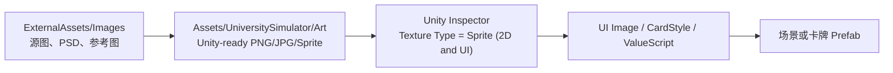
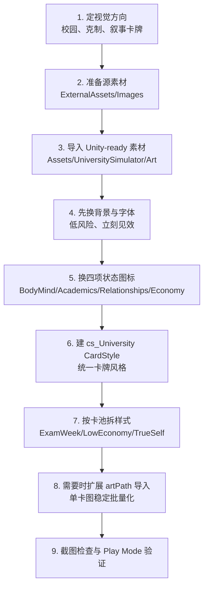

# 大学生模拟器视觉替换指南

本文基于当前 Unity 工程状态整理，目标是告诉你“想换某个视觉元素时，应该去哪里改、怎么改、哪些地方不要直接动”。当前项目使用 Unity `2022.3.62f3c1`，主场景是 `Assets/Kings/Game.unity`，UI 路线是 UGUI，不是 UI Toolkit。

## 0. 先看界面地图


| 编号 | 屏幕区域 | Unity 层级入口 | 主要替换内容 |
| --- | --- | --- | --- |
| 1 | 四项状态图标/Slider | `GameCanvas/GamePanel/TopPanel/MainStatsPanel` | 身心、学业、人际、经济图标，状态条底图/填充图，选择预览图标 |
| 2 | 玩家名与年份文本 | `GameCanvas/GamePanel/TopPanel/PlayerPanel` | 顶部姓名、年份文字、字体、颜色 |
| 3 | 卡牌样式/卡图/图标 | `GameCanvas/Cards/MainMenuCard` 与 `Assets/UniversitySimulator/Prefabs/Cards/...` | 卡牌正面、背面、主图标、卡色、标题/正文/选项字体 |
| 4 | 背景画面 | `BackgroundCanvas/Background` | 全屏背景图、背景色 |
| 5 | 底部菜单与物品栏 | `GameCanvas/InventoryPanel`、`MenuCanvas/MenuPanel` | 菜单按钮、物品栏格子、弹出菜单面板 |
| 6 | 卡牌 Prefab 来源 | `Assets/UniversitySimulator/Prefabs/Cards/<Group>/US_E###.prefab` | 每张事件卡生成后的 prefab，本项目卡牌视觉落点 |

## 1. 当前工程的关键事实

- 当前加载场景：`Assets/Kings/Game.unity`。
- 当前场景 UI：4 个 Canvas，核心是 `BackgroundCanvas`、`GameCanvas`、`MenuCanvas`、`ExitCanvas`。
- 当前大学生事件卡：`108` 张，已生成到 `Assets/UniversitySimulator/Prefabs/Cards/`。
- 当前所有事件卡 `styleName` 基本是 `cs_None`。
- 当前 `cards_v1_program.csv` 里的 `artPath` 为空，而且导入器暂时没有读取 `artPath`。
- 当前导入器入口：Unity 菜单 `University Simulator > Cards > Import Program Cards And Wire Scene`。
- 当前导入器脚本：`Assets/UniversitySimulator/Editor/UniversityCardImportTool.cs`。
- 当前导入器会读 `styleName`，再从 `Assets/Kings/cards/_templates/CardStyle_List.asset` 找对应 `KingsCardStyle`。

结论：现在最稳的批量视觉入口是 `CardStyle` 和 UI Image 引用；单张卡图如果只手改 prefab，下次重新导入卡牌时可能被覆盖。

## 2. 素材放哪里

源文件和 Unity 可用资源要分开。



推荐目录如下，当前没有的目录可以在 Unity Project 面板或文件系统中新建：

```text
Assets/UniversitySimulator/
  Art/
    Backgrounds/
    Cards/
    UI/
    Icons/
    Fonts/
ExternalAssets/
  Images/
```

命名建议：

- 背景：`bg_dorm_night.png`、`bg_library_day.png`
- 卡牌正背面：`card_front_university.png`、`card_back_university.png`
- 状态图标：`icon_body_mind.png`、`icon_academics.png`、`icon_relationships.png`、`icon_economy.png`
- 状态变化预览：`status_up.png`、`status_down.png`、`status_unknown.png`、`status_none.png`
- 单张卡图：`card_E001_roommates.png`、`card_E002_morning_class.png`

现有资源尺寸可作为参考：

| 类型 | 当前示例 | 尺寸 |
| --- | --- | --- |
| 卡牌正面 | `Assets/Kings/graphics/card_front01.png` | `840 x 1240` |
| 卡牌背面 | `Assets/Kings/graphics/card_back01.png` | `840 x 1240` |
| 背景 | `Assets/Kings/graphics/background00.png` | `1920 x 1920` |
| 小状态图标 | `Assets/Kings/graphics/army_small.png` 等 | `124 x 124` |
| 卡牌中心图标 | `Assets/Kings/graphics/crown.png` | `200 x 200` |

导入 PNG/JPG 后，在 Inspector 里建议设置：

| 用途 | Texture Type | Sprite Mode | 建议 |
| --- | --- | --- | --- |
| UI 图标、卡牌图、按钮 | `Sprite (2D and UI)` | `Single` | 保留透明通道，Compression 先用 Normal 或 High Quality |
| 大背景 | `Sprite (2D and UI)` | `Single` | Max Size 至少 `2048`，避免模糊 |
| 字体 | `.ttf` / `.otf` | 不适用 | 放 `Assets/UniversitySimulator/Art/Fonts/` |

## 3. 替换背景

适合改：宿舍、教室、图书馆、校园夜景等大背景。

操作步骤：

1. 把背景图放到 `Assets/UniversitySimulator/Art/Backgrounds/`。
2. 选中图片，在 Inspector 设置 `Texture Type = Sprite (2D and UI)`。
3. 打开场景 `Assets/Kings/Game.unity`。
4. 在 Hierarchy 选中 `BackgroundCanvas/Background`。
5. 在 Inspector 的 `Image` 组件里，把 `Source Image` 换成新背景 Sprite。
6. 如果画面裁切不对，调 `RectTransform` 或图片自身裁切，不要直接拉伸到变形。

建议背景图仍做成接近正方形或足够大的图。当前模板背景是 `1920 x 1920`，对横竖屏裁切比较友好。

## 4. 替换顶部四项状态图标和状态条

本项目四项状态已经映射为：

| 设计名 | 值对象 | 当前 UI 旧名 | 建议显示 |
| --- | --- | --- | --- |
| 身心 | `Values/BodyMind` | `ArmySlider` | 心理/体力/睡眠相关图标 |
| 学业 | `Values/Academics` | `PeopleSlider` | 书本/课程/成绩相关图标 |
| 人际 | `Values/Relationships` | `ReligionSlider` | 对话/关系/社交相关图标 |
| 经济 | `Values/Economy` | `MoneySlider` | 钱包/饭卡/生活费相关图标 |

UI 层级位置：

```text
GameCanvas/GamePanel/TopPanel/MainStatsPanel/
  ArmySlider
    Background
    Fill
    StatChangePrevImage
    StatChangePrevText
  PeopleSlider
  ReligionSlider
  MoneySlider
```

推荐改法：

1. 先准备四个 `124 x 124` 或更高分辨率的透明 PNG。
2. 导入到 `Assets/UniversitySimulator/Art/Icons/`。
3. 在 Hierarchy 里选中对应 Slider 的 `Background`、`Fill` 或具体 Image 子节点。
4. 在 `Image` 组件里替换 `Source Image`。
5. 在 `Values/BodyMind` 等值对象的 `ValueScript > UserInterface` 里检查绑定：
   - `uiSlider`：对应顶部 Slider。
   - `miniatureSprite`：数值变化弹出时的小图标。
   - `valueDependingIcons.baseIcons`：会随数值变化被替换的目标 Image。
   - `valueDependingIcons.valueIcon`：不同数值区间对应的图标。
   - `valueChangePreview.valueChangeImage`：滑动预览时的涨跌/未知图标。
   - `valueChangePreview.valueChangeText`：如果不想显示精确数值，应清空或关闭。

当前设计要求“不显示精确数字”。如果看到 `StatChangePrevText` 显示 `+5`、`-8` 这类数字，优先在 `Values` 对象上的 `ValueChangePreview` 配置中关闭文字显示，或清空各 `ValueScript.UserInterface.valueChangePreview.valueChangeText` 引用。

## 5. 替换卡牌整体样式

卡牌整体样式由 `KingsCardStyle` 控制。脚本字段如下：

```text
KingsCardStyle
  prefab
  cardColor
  cardFront
  cardBack
  icon
```

对应逻辑：

- `cardColor`：卡牌底色。
- `cardFront`：卡牌正面图。
- `cardBack`：卡牌背面图。
- `icon`：卡牌中心图标。
- `prefab`：导入新卡时使用的基础 prefab。

当前样式 `cs_None` 在：

```text
Assets/Kings/cards/_templates/cs_None.asset
```

但不要直接把 `cs_None` 当成大学生项目的正式样式去覆盖。推荐路线是复制一个新样式：

1. 在 Project 面板复制 `Assets/Kings/cards/_templates/cs_None.asset`。
2. 把副本移到 `Assets/UniversitySimulator/Art/Cards/CardStyles/`，命名为 `cs_University.asset`。
3. 在 `cs_University.asset` 的 Inspector 里替换：
   - `Card Color`
   - `Card Front`
   - `Card Back`
   - `Icon`
4. 打开 `Assets/Kings/cards/_templates/CardStyle_List.asset`。
5. 在 `cardStyles` 列表里添加 `cs_University.asset`。
6. 打开 `Assets/UniversitySimulator/Data/cards_v1_program.csv`。
7. 把需要使用大学样式的行 `styleName` 改成 `cs_University`。
8. 在 Unity 菜单运行 `University Simulator > Cards > Import Program Cards And Wire Scene`。
9. 查看 `Assets/UniversitySimulator/Data/cards_v1_kings_import_report.json`，确认 `errors` 为空。

如果你只想快速看效果，可以临时改 `cs_None.asset`，但这会影响所有使用 `cs_None` 的卡，包括 Kings 示例卡。正式版本不建议这么做。

## 6. 替换单张卡图

当前表里有 `artPath` 字段，但导入器暂时没有读取它，所以有两种路线。

**推荐路线：用样式承载视觉差异**

适合：一批卡共用同一主题，比如考试周、经济压力、真实自我。

1. 复制 `cs_None.asset` 为新样式，例如：
   - `cs_ExamWeek`
   - `cs_LowEconomy`
   - `cs_TrueSelf`
2. 为每个样式设置不同 `cardFront`、`cardBack`、`icon`、`cardColor`。
3. 把 `cards_v1_program.csv` 里对应卡池的 `styleName` 批量改成新样式名。
4. 重新运行导入器。

**临时路线：手动改单张 prefab**

适合：只想试一张卡的视觉，不准备马上批量导入。

1. 打开 `Assets/UniversitySimulator/Prefabs/Cards/<Group>/US_E###.prefab`。
2. 进入 Prefab Mode。
3. 展开 `Card`。
4. 选中 `Icon`、`Card`、`CardBack` 或对应 Image。
5. 在 `Image > Source Image` 替换 Sprite。
6. 保存 prefab。

注意：下次运行 `University Simulator > Cards > Import Program Cards And Wire Scene` 可能会重新生成或刷新 prefab，手动改动可能丢失。需要长期稳定时，应让视觉信息进入 `styleName` 或后续扩展导入器读取 `artPath`。

后续如果要真正支持“每张卡独立卡图”，建议扩展 `UniversityCardImportTool.cs`：

- 读取 `cards_v1_program.csv` 的 `artPath`。
- 使用 `AssetDatabase.LoadAssetAtPath<Sprite>(artPath)` 加载图。
- 在 `ConfigurePrefabs` 阶段找到 `Card/Icon` 或目标 `Image`。
- 把 `Image.sprite` 设置为该 Sprite。
- 在导入报告里检查 artPath 是否存在。

## 7. 替换字体和中文显示

当前场景 UI 多数使用 legacy `UnityEngine.UI.Text`，不是 TextMeshPro。要保证中文显示稳定，建议导入一个支持中文的字体，例如思源黑体 / Noto Sans SC。

操作步骤：

1. 字体文件放到 `Assets/UniversitySimulator/Art/Fonts/`。
2. 打开场景或 prefab。
3. 选中 Text 组件，比如：
   - `GameCanvas/Cards/MainMenuCard/Card/TitleText`
   - `GameCanvas/Cards/MainMenuCard/Card/QuestionText`
   - `GameCanvas/GamePanel/TopPanel/PlayerPanel/PlayerNameText`
   - `GameCanvas/GamePanel/TopPanel/PlayerPanel/YearsText`
4. 在 Inspector 的 `Text` 组件里替换 `Font`。
5. 检查字号、行距和对齐。

卡牌文本本身来自：

```text
Assets/UniversitySimulator/Data/cards_v1_program.csv
Assets/UniversitySimulator/Data/cards_v1_kings_text_import.csv
```

不要在生成后的 prefab 里长期手改文本；下一次导入会以 CSV 为准。

## 8. 替换菜单、按钮、弹窗 UI

主要层级：

```text
MenuCanvas/MenuPanel
  PlayerInfoPanel
  HighscorePanel
  AchievementsPanel
  QuestsPanel
  SettingsPanel
  BottomMenuPanel/MenuButtonPanel

ExitCanvas/ExitPanel

GameCanvas/InventoryPanel
```

常见替换：

| 想改什么 | 去哪里 |
| --- | --- |
| 底部菜单按钮图标 | `MenuCanvas/MenuPanel/BottomMenuPanel/MenuButtonPanel/*Button/Icon` |
| 菜单选中态图标 | `*Button/selIcon` |
| 物品栏格子 | `GameCanvas/InventoryPanel/InventoryBackpanel/emptySlot` |
| 设置面板底图 | `MenuCanvas/MenuPanel/SettingsPanel` 及其子 Image |
| 退出确认弹窗 | `ExitCanvas/ExitPanel` |

如果只是换图，改 Image 的 `Source Image`。如果要改布局，优先调 `RectTransform`、Anchor、Layout Group，不要直接删掉已有对象。已有脚本可能通过序列化引用绑定这些节点。

## 9. 推荐的整体改造顺序



建议先做“全局壳层”再做“每张卡图”。原因很简单：背景、字体、状态图标、卡牌正背面会决定整体气质；单张卡图数量多，最好等样式规则稳定后再投入。

## 10. 每次改视觉前的安全清单

- 不删除 `.meta` 文件。
- 不直接覆盖 `Assets/Kings/` 原图，除非只是临时试验且知道影响范围。
- 新项目素材优先放 `Assets/UniversitySimulator/Art/`。
- 源图、PSD、参考图优先放 `ExternalAssets/Images/`。
- 改 CSV 后再运行导入器，改 prefab 前先确认是否会被导入器覆盖。
- 改 `CardStyle_List.asset` 时，只追加新样式，不移除旧样式。
- 改 `valueDefinitions.cs` 时，不删除、不重排、不在中间插入枚举。
- UI 只显示趋势，不显示精确数值。
- 改完后至少截一张 Game View 图，确认背景、状态栏、卡牌、底部栏没有错位。

## 11. 快速索引

| 需求 | 首选入口 |
| --- | --- |
| 换全屏背景 | `BackgroundCanvas/Background` |
| 换顶部四项图标 | `GameCanvas/GamePanel/TopPanel/MainStatsPanel/*Slider` |
| 换四项状态逻辑绑定 | `Values/BodyMind`、`Values/Academics`、`Values/Relationships`、`Values/Economy` |
| 换卡牌统一色彩/正背面/中心图标 | 新建 `KingsCardStyle`，再改 CSV 的 `styleName` |
| 改卡牌标题/正文/选项 | `Assets/UniversitySimulator/Data/cards_v1_program.csv` |
| 看导入结果 | `Assets/UniversitySimulator/Data/cards_v1_kings_import_report.json` |
| 改单张卡 prefab | `Assets/UniversitySimulator/Prefabs/Cards/<Group>/US_E###.prefab` |
| 改底部菜单 | `MenuCanvas/MenuPanel/BottomMenuPanel` |
| 改物品栏 | `GameCanvas/InventoryPanel` |
| 改字体 | 各 Text 组件的 `Font` 字段 |

